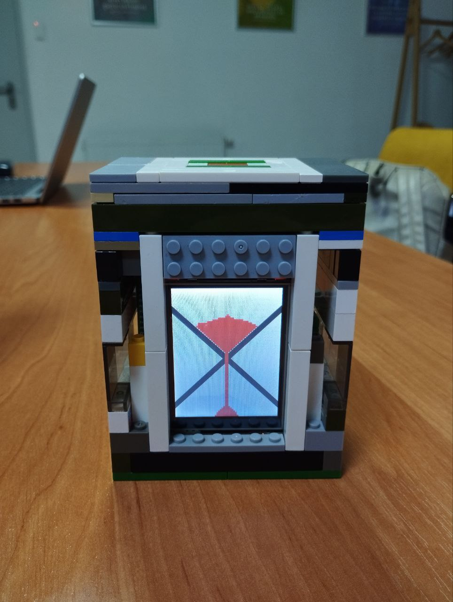

# Electronic Hourglass
Repo for project "Electronic Hourglass"

This is a project for the course "Principles of organization of computer" at Faculty of Applied Sciences, Ukrainian Catholic University. Lviv, Ukraine 2023.

Team members:
- [Sviatoslav Stehnii]( https://github.com/sviatoweb)
- [Taras Lysun](https://github.com/taraslysun)
- [Ielyzaveta Arnauta](https://github.com/lizaArnauta)
- [Bohdan Hashchuk](https://github.com/gashchukk)

## Goal
Goal of our project was to simulate the hourglass using microcontroller STM32F411E-DISCO.

## Used components
- [STM32F411E-DISCO](https://www.st.com/en/evaluation-tools/32f411ediscovery.html)

- [ILI9341](https://cdn-shop.adafruit.com/datasheets/ILI9341.pdf) LCD display

## Software
Main software for this project is written in C using [STM32CubeIDE](https://www.st.com/en/development-tools/stm32cubeide.html)

